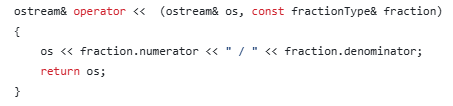

# Rational Fraction Calculator  
This project was assigned in my CSCI 124 class.
## How to Download and Run this Program:
**This Will Be Added Later In This Module**
## Original Instructions:  
Rational fractions are of the form a/b, in which a and b are integers and b ≠ 0. In this exercise, by “fractions” we mean rational fractions. Suppose a/b and c/d are fractions. Arithmetic operations on fractions are defined by the following rules:

a / b + c / d = (ad + bc) / bd
a / b - c / d = (ad - bc) / bd
a / b * c / d = ac / bd
(a / b) / (c / d) = ad / bc, in which c/d ≠ 0
Fractions are compared as follows: a/b op c/d if ad op bc, in which op is any of the relational operations. For example, a/b < c/d if ad < bc. Design a class—say, fractionType—that performs the arithmetic and relational operations on fractions. Overload the arithmetic and relational operators so that the appropriate symbols can be used to perform the operation. Also, overload the stream insertion and stream extraction operators for easy input and output.

Write a C++ program that, using the class fractionType, performs operations on fractions.  

## How My Solution Works:  
This implementation of the class **fractionType** provides a complete solution for working with rational fractions of the form *a/b*, where *a* and *b* are integers and *b!=0*.  
1.  My output operator prints fractions in the form a/b.  
  
2.  My input operator reads a fraction in the form a/b.  
**Note:The in-class example ends here, but the student should add more information about this project.**

## Final Thoughts:  
I enjoyed this project because it helped me see the value in overloading functions to work with different programming objects.
